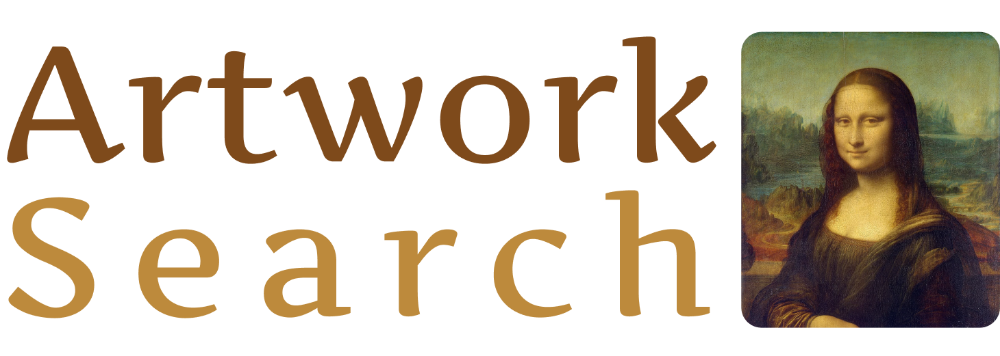

# Artwork Similarity Search

This is a streamlit app that allows users to search for similar artworks based on an uploaded image or a text description. The app uses a pretrained deep learning model to encode the uploaded image into a vector representation, which is then compared against a database of artworks using the Qdrant similarity search engine. The top matching artworks are then displayed to the user along with some information about the artist.

## Installation

Dataset used in this project: [ikarus777/best-artworks-of-all-time](https://www.kaggle.com/datasets/ikarus777/best-artworks-of-all-time)

For simplicity sake, only 20 artworks per artist are kept.

Data preparation: [data_prep.ipynb](data/data_prep.ipynb)

The final data is encoded using the CLIP model, the resulting embeddings are then stored in a qdrant collection in addition to a payload containing the image path and artist name.

These images are also sotred in a GCP bucket so they can be accessible when any match is found after a similarity search.

1. Clone this repository: `git clone https://github.com/Otman404/artwork-similarity-search.git`
2. Install the required packages: `pip install -r requirements.txt`
3. Update [config.py](config.py) as well as the streamlit config file located in `.streamlit/secrets.toml` ([learn more](https://docs.streamlit.io/streamlit-community-cloud/get-started/deploy-an-app/connect-to-data-sources/secrets-management)) with Qdrant and GCP credentials.

4. Start the Streamlit app: `streamlit run app.py`

## Usage

1. Upload an image or write a text description to search for similar artworks.
2. View the list of similar artworks with some information about their artists.

## Image Search

## Text Search
